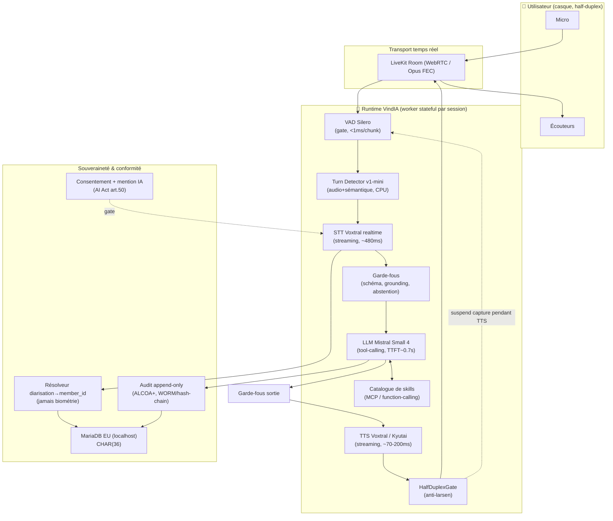
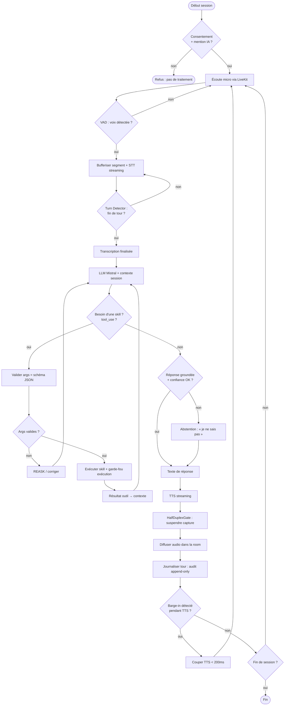
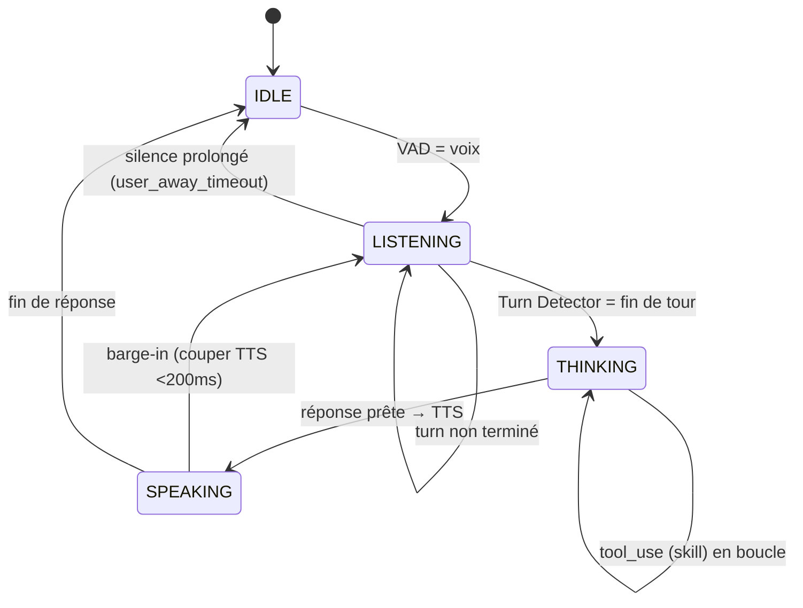
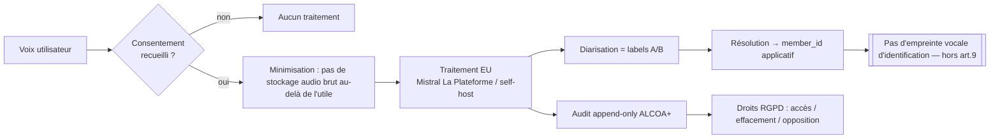
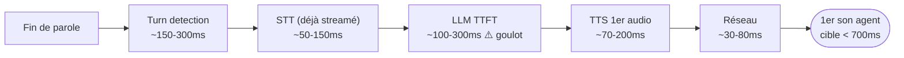

# Modèle complet — Architecture & algorigrammes (VindIA)

> Diagrammes en **Mermaid** (rendus nativement par GitHub et Notion). Modèle cible « complet avec
> visuel et algorigramme » demandé. Toutes les briques renvoient à la veille ([`03`](./03-VEILLE-SOURCEE.md)).

## 1. Architecture système (vue d'ensemble)

## 2. Algorigramme — boucle conversationnelle (un tour)

## 3. Machine à états — tour de parole & barge-in

## 4. Flux de conformité (données & traçabilité)

## 5. Décomposition du budget de latence (cible)

> Réf. humaine ~200 ms ; cible industrie sub-500 ms. Le **LLM TTFT** domine → privilégier un modèle
> rapide (Mistral Small 4) + streaming partout. Sources : voir [`03` §6](./03-VEILLE-SOURCEE.md).

## 6. Mapping briques → code existant du dépôt

| Brique | Fichier dépôt | État |
|---|---|---|
| Session/consentement | `shared/agent/session.py` | ✅ posé |
| VAD | `shared/agent/audio/vad.py` (`VoiceSegmenter`) | ✅ testé (stdlib) |
| Transport LiveKit | `shared/agent/audio/livekit_io.py` | 🟠 squelettes TODO |
| Orchestration tour | `shared/agent/router.py` + `main.py` | 🟠 câblage partiel |
| Runtime STT→LLM→TTS | `shared/agent/runtime.py` (`Protocol`) | ✅ contrats / 🟠 adaptateurs |
| Résolveur diarisation | `shared/agent/store.py` (`make_member_resolver`) | 🟠 à brancher |
| Audit | `shared/agent/store.py` (`make_audit_sink`) | 🟠 à brancher |
| Persistance | `db/01-schema.sql` (MariaDB CHAR(36)) | ✅ validé |
