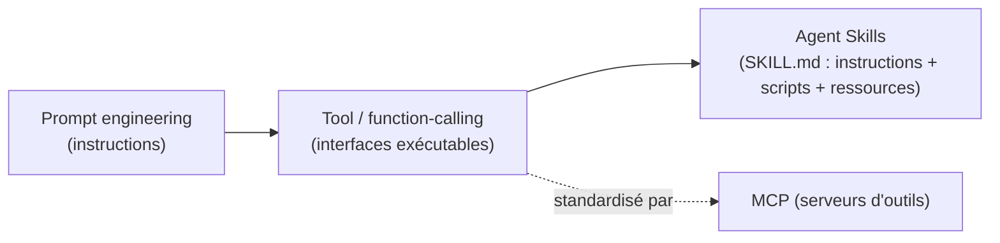
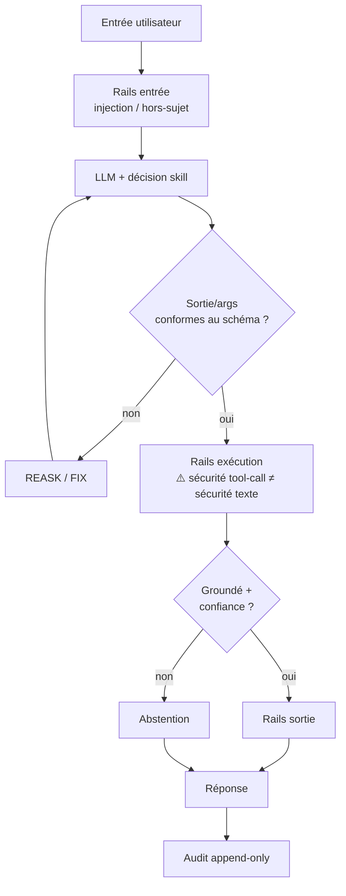

# Catalogue de compétences / skills — VindIA

> Modèle **fiable** de skills réutilisables demandé. Fondé sur la veille ([`03` §10](./03-VEILLE-SOURCEE.md)).
> Principe : une compétence = capacité **déclenchable**, **validée** et **traçable**.

## 1. Trois niveaux d'abstraction



- **Tool/function-calling** : la brique atomique (schéma JSON + exécution côté app).
- **MCP** : standardise l'accès à des outils/données externes (serveurs réutilisables).
- **Agent Skill** : empaquette le **savoir-faire procédural** (quand/comment utiliser les outils).

## 2. Anatomie d'une skill VindIA (gabarit)

```yaml
# SKILL.md (front-matter)
name: <verbe-objet, ex. "rechercher-document">
description: <quand l'utiliser, en 1-2 phrases — sert au déclenchement>
version: 0.1.0
inputs_schema: <JSON Schema 2020-12 des arguments>
outputs_schema: <JSON Schema du résultat attendu>
guardrails:
  - validation_schema        # rejet si args/sortie non conformes
  - grounding                # réponse appuyée sur des sources vérifiables
  - abstention               # "je ne sais pas" si confiance faible
  - hitl                     # validation humaine si action à fort impact
souverainete: <EU-only | self-host | API-EU>
audit: true                  # tracer chaque appel (ALCOA+)
```

Corps Markdown = instructions d'usage + exemples + cas limites (pattern Anthropic Agent Skills).

## 3. Catalogue v1 proposé (déclenché par la voix)

| Skill | Type | Déclencheur (intention) | Garde-fous | Souveraineté | Statut |
|---|---|---|---|---|---|
| `dire-mention-ia` | interne | 1er contact | obligatoire (AI Act art.50) | EU | à faire |
| `recueillir-consentement` | interne | avant traitement | bloquant si refus | EU | à faire |
| `repondre-conversation` | LLM | question générale | grounding + abstention | EU (Mistral) | à faire |
| `memoire-session` | mémoire | « rappelle-toi… » | TTL session, pas de PII durable | EU | à faire |
| `rechercher-info` | tool/MCP | « cherche… » | sources citées, grounding | EU `[arbitrer]` | à faire |
| `resoudre-locuteur` | interne | multi-locuteur | label→member_id, **pas de biométrie** | EU | à brancher |
| `journaliser-tour` | interne | chaque tour | append-only, hash-chain | EU | à brancher |
| `escalader-humain` | HITL | action sensible / incertitude | validation humaine | EU | V2 |

## 4. Garde-fous de fiabilité (defense-in-depth)



Sources des patterns : Structured Outputs ([OpenAI](https://openai.com/index/introducing-structured-outputs-in-the-api/)),
NeMo Guardrails ([EMNLP 2023](https://aclanthology.org/2023.emnlp-demo.40/)), Guardrails AI
([github](https://github.com/guardrails-ai/guardrails)), texte≠tool-call ([arXiv 2602.16943](https://arxiv.org/pdf/2602.16943)),
Constitutional AI ([arXiv 2212.08073](https://arxiv.org/abs/2212.08073)).

## 5. Évaluation des skills

| Niveau | Quand | Quoi | Réf. |
|---|---|---|---|
| L1 Unit | chaque PR | schéma de sortie, présence des args requis, sûreté de base (< 1 min) | testing pyramid agents |
| L2 Intégration | nightly | scénarios multi-étapes sur « tool tapes » enregistrées | idem |
| L3 E2E | jalon | run complet sur staging + audio réel | idem |
| Capacité | jalon | AgentBench / ToolLLM / GAIA / SWE-bench | [AgentBench](https://arxiv.org/abs/2308.03688) · [ToolLLM](https://arxiv.org/abs/2307.16789) · [GAIA](https://arxiv.org/abs/2311.12983) |
| Fiabilité | jalon | stress / pannes partielles / dégradation | [ReliabilityBench](https://arxiv.org/pdf/2601.06112) |

## 6. Gouvernance (⚠️ sécurité)

Une étude relève **26,1 %** de skills communautaires vulnérables ([arXiv 2602.12430](https://arxiv.org/abs/2602.12430)).
→ Pour VindIA : skills **revues** avant ajout, versionnées (SemVer), périmètre minimal, secrets hors
skill, audit de chaque exécution, et **revue humaine** pour toute skill à effet de bord.

## 7. Roadmap skills

- **V1** : skills internes (mention IA, consentement, mémoire session, journalisation, résolution locuteur)
  + `repondre-conversation` + 1 skill `rechercher-info`.
- **V2** : skills métier via **MCP** (catalogue extensible), mémoire long terme (profil) avec TTL,
  `escalader-humain` (HITL).
- **V3** : skills composites (orchestration multi-skills) + évaluation continue en prod.
